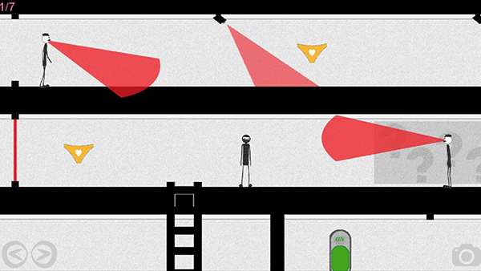

This is a college project we thought would be fun to share. It's a 2D stealth game for Android devices built in Java using the [libGDX framework](https://www.libgdx.com/).

You play as a sneaky burglar  and have to steal all the... umm... comfy garments. 

As you make your way through the level, you'll have to avoid deadly lasers, surveillance cameras, and patrolling guards.

# How to play
- Use the on-screen arrows to control the snatcher.

- Hold your device screen-up to hide yourself as a not-at-all-suspicious painting. Guards will ignore you in this state.

- Press the camera icon and tilt your device to move the camera and take a peek at your surroundings.

- Tap the ?-walls to make a knocking sound that distracts guards.

Getting caught by anything will result in game over and force you back to a previous checkpoint.

# Multiplayer
Multiplayer is a little finicky as it was a very last minute addition. Make sure you and your buddy are connected to the same wi-fi connection, then have one of you act as the host and the other join.

In this mode, you'll both compete to catch all the items and reach the end of the level as quickly as possible. The twist being you can now plant bombs, which send your opponent all the way back to the very beginning of the level. To make matters worse, you cannot see bombs planted by your opponent, so there's no way of telling where they are until it's too late. Pure friendship destroying mayhem.
